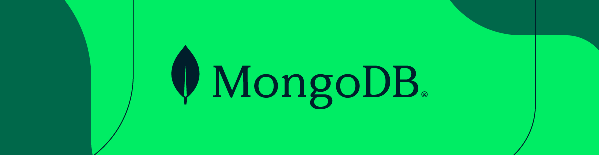

<h1 align="center">LeafyGreen UI</h1>

<p align="center">A library of React components, CSS patterns, and CLI tools for MongoDB's LeafyGreen Design System.</p>

<p align="center">
   <a align="center" href="https://mongodb.design">
      
   </a>
</p>

<p align="center">
   <a href="https://storybook.mongodb.design">
      
   </a>
</p>

<p align="center">
   
   
</p>

## Getting Started

### With LeafyGreen CLI

1. Create or open a React project
2. Install the LeafyGreen CLI

```bash
npm install -g @lg-tools/cli
```

3. Install all, or some LeafyGreen components

```bash
lg install
```

```bash
lg install button combobox
```

3. Import LeafyGreen components into your project

```tsx
import Button from '@leafygreen-ui/button';
import { Combobox, ComboboxOptions } from '@leafygreen-ui/combobox';
```

### Without CLI

1. Create or open a React project
2. Install individual LeafyGreen components using `npm` or `yarn`

```bash
yarn add @leafygreen-ui/button
```

3. Import LeafyGreen components into your project

```tsx
import Button from '@leafygreen-ui/button';
```

## Packages

| Package                                                                                           | Latest                                                                                                                                          | Downloads                                                                                  |
| ------------------------------------------------------------------------------------------------- | ----------------------------------------------------------------------------------------------------------------------------------------------- | ------------------------------------------------------------------------------------------ |
| [@leafygreen-ui/a11y](http://mongodb.design/component/a11y/example)                               | [](https://www.npmjs.com/package/@leafygreen-ui/a11y)                               |                 |
| [@leafygreen-ui/badge](http://mongodb.design/component/badge/example)                             | [](https://www.npmjs.com/package/@leafygreen-ui/badge)                             |                |
| [@leafygreen-ui/banner](http://mongodb.design/component/banner/example)                           | [](https://www.npmjs.com/package/@leafygreen-ui/banner)                           |               |
| [@leafygreen-ui/box](http://mongodb.design/component/box/example)                                 | [](https://www.npmjs.com/package/@leafygreen-ui/box)                                 |                  |
| [@leafygreen-ui/button](http://mongodb.design/component/button/example)                           | [](https://www.npmjs.com/package/@leafygreen-ui/button)                           |               |
| [@leafygreen-ui/callout](http://mongodb.design/component/callout/example)                         | [](https://www.npmjs.com/package/@leafygreen-ui/callout)                         |              |
| [@leafygreen-ui/card](http://mongodb.design/component/card/example)                               | [](https://www.npmjs.com/package/@leafygreen-ui/card)                               |                 |
| [@leafygreen-ui/checkbox](http://mongodb.design/component/checkbox/example)                       | [](https://www.npmjs.com/package/@leafygreen-ui/checkbox)                       |             |
| [@leafygreen-ui/code](http://mongodb.design/component/code/example)                               | [](https://www.npmjs.com/package/@leafygreen-ui/code)                               |                 |
| [@leafygreen-ui/combobox](http://mongodb.design/component/combobox/example)                       | [](https://www.npmjs.com/package/@leafygreen-ui/combobox)                       |             |
| [@leafygreen-ui/confirmation-modal](http://mongodb.design/component/confirmation-modal/example)   | [](https://www.npmjs.com/package/@leafygreen-ui/confirmation-modal)   |   |
| [@leafygreen-ui/copyable](http://mongodb.design/component/copyable/example)                       | [](https://www.npmjs.com/package/@leafygreen-ui/copyable)                       |             |
| [@leafygreen-ui/emotion](http://mongodb.design/component/emotion/example)                         | [](https://www.npmjs.com/package/@leafygreen-ui/emotion)                         |              |
| [@leafygreen-ui/empty-state](http://mongodb.design/component/empty-state/example)                 | [](https://www.npmjs.com/package/@leafygreen-ui/empty-state)                 |          |
| [@leafygreen-ui/expandable-card](http://mongodb.design/component/expandable-card/example)         | [](https://www.npmjs.com/package/@leafygreen-ui/expandable-card)         |      |
| [@leafygreen-ui/form-footer](http://mongodb.design/component/form-footer/example)                 | [](https://www.npmjs.com/package/@leafygreen-ui/form-footer)                 |          |
| [@leafygreen-ui/guide-cue](http://mongodb.design/component/guide-cue/example)                     | [](https://www.npmjs.com/package/@leafygreen-ui/guide-cue)                     |            |
| [@leafygreen-ui/hooks](http://mongodb.design/component/hooks/example)                             | [](https://www.npmjs.com/package/@leafygreen-ui/hooks)                             |                |
| [@leafygreen-ui/icon](http://mongodb.design/component/icon/example)                               | [](https://www.npmjs.com/package/@leafygreen-ui/icon)                               |                 |
| [@leafygreen-ui/icon-button](http://mongodb.design/component/icon-button/example)                 | [](https://www.npmjs.com/package/@leafygreen-ui/icon-button)                 |          |
| [@leafygreen-ui/inline-definition](http://mongodb.design/component/inline-definition/example)     | [](https://www.npmjs.com/package/@leafygreen-ui/inline-definition)     |    |
| [@leafygreen-ui/input-option](http://mongodb.design/component/input-option/example)               | [](https://www.npmjs.com/package/@leafygreen-ui/input-option)               |         |
| [@leafygreen-ui/leafygreen-provider](http://mongodb.design/component/leafygreen-provider/example) | [](https://www.npmjs.com/package/@leafygreen-ui/leafygreen-provider) |  |
| [@leafygreen-ui/lib](http://mongodb.design/component/lib/example)                                 | [](https://www.npmjs.com/package/@leafygreen-ui/lib)                                 |                  |
| [@leafygreen-ui/loading-indicator](http://mongodb.design/component/loading-indicator/example)     | [](https://www.npmjs.com/package/@leafygreen-ui/loading-indicator)     |    |
| [@leafygreen-ui/logo](http://mongodb.design/component/logo/example)                               | [](https://www.npmjs.com/package/@leafygreen-ui/logo)                               |                 |
| [@leafygreen-ui/marketing-modal](http://mongodb.design/component/marketing-modal/example)         | [](https://www.npmjs.com/package/@leafygreen-ui/marketing-modal)         |      |
| [@leafygreen-ui/menu](http://mongodb.design/component/menu/example)                               | [](https://www.npmjs.com/package/@leafygreen-ui/menu)                               |                 |
| [@leafygreen-ui/modal](http://mongodb.design/component/modal/example)                             | [](https://www.npmjs.com/package/@leafygreen-ui/modal)                             |                |
| [@leafygreen-ui/number-input](http://mongodb.design/component/number-input/example)               | [](https://www.npmjs.com/package/@leafygreen-ui/number-input)               |         |
| [@leafygreen-ui/pagination](http://mongodb.design/component/pagination/example)                   | [](https://www.npmjs.com/package/@leafygreen-ui/pagination)                   |           |
| [@leafygreen-ui/palette](http://mongodb.design/component/palette/example)                         | [](https://www.npmjs.com/package/@leafygreen-ui/palette)                         |              |
| [@leafygreen-ui/password-input](http://mongodb.design/component/password-input/example)           | [](https://www.npmjs.com/package/@leafygreen-ui/password-input)           |       |
| [@leafygreen-ui/pipeline](http://mongodb.design/component/pipeline/example)                       | [](https://www.npmjs.com/package/@leafygreen-ui/pipeline)                       |             |
| [@leafygreen-ui/polymorphic](http://mongodb.design/component/polymorphic/example)                 | [](https://www.npmjs.com/package/@leafygreen-ui/polymorphic)                 |          |
| [@leafygreen-ui/popover](http://mongodb.design/component/popover/example)                         | [](https://www.npmjs.com/package/@leafygreen-ui/popover)                         |              |
| [@leafygreen-ui/portal](http://mongodb.design/component/portal/example)                           | [](https://www.npmjs.com/package/@leafygreen-ui/portal)                           |               |
| [@leafygreen-ui/radio-box-group](http://mongodb.design/component/radio-box-group/example)         | [](https://www.npmjs.com/package/@leafygreen-ui/radio-box-group)         |      |
| [@leafygreen-ui/radio-group](http://mongodb.design/component/radio-group/example)                 | [](https://www.npmjs.com/package/@leafygreen-ui/radio-group)                 |          |
| [@leafygreen-ui/ripple](http://mongodb.design/component/ripple/example)                           | [](https://www.npmjs.com/package/@leafygreen-ui/ripple)                           |               |
| [@leafygreen-ui/search-input](http://mongodb.design/component/search-input/example)               | [](https://www.npmjs.com/package/@leafygreen-ui/search-input)               |         |
| [@leafygreen-ui/segmented-control](http://mongodb.design/component/segmented-control/example)     | [](https://www.npmjs.com/package/@leafygreen-ui/segmented-control)     |    |
| [@leafygreen-ui/select](http://mongodb.design/component/select/example)                           | [](https://www.npmjs.com/package/@leafygreen-ui/select)                           |               |
| [@leafygreen-ui/side-nav](http://mongodb.design/component/side-nav/example)                       | [](https://www.npmjs.com/package/@leafygreen-ui/side-nav)                       |             |
| [@leafygreen-ui/skeleton-loader](http://mongodb.design/component/skeleton-loader/example)         | [](https://www.npmjs.com/package/@leafygreen-ui/skeleton-loader)         |      |
| [@leafygreen-ui/split-button](http://mongodb.design/component/split-button/example)               | [](https://www.npmjs.com/package/@leafygreen-ui/split-button)               |         |
| [@leafygreen-ui/stepper](http://mongodb.design/component/stepper/example)                         | [](https://www.npmjs.com/package/@leafygreen-ui/stepper)                         |              |
| [@leafygreen-ui/table](http://mongodb.design/component/table/example)                             | [](https://www.npmjs.com/package/@leafygreen-ui/table)                             |                |
| [@leafygreen-ui/tabs](http://mongodb.design/component/tabs/example)                               | [](https://www.npmjs.com/package/@leafygreen-ui/tabs)                               |                 |
| [@leafygreen-ui/testing-lib](http://mongodb.design/component/testing-lib/example)                 | [](https://www.npmjs.com/package/@leafygreen-ui/testing-lib)                 |          |
| [@leafygreen-ui/text-area](http://mongodb.design/component/text-area/example)                     | [](https://www.npmjs.com/package/@leafygreen-ui/text-area)                     |            |
| [@leafygreen-ui/text-input](http://mongodb.design/component/text-input/example)                   | [](https://www.npmjs.com/package/@leafygreen-ui/text-input)                   |           |
| [@leafygreen-ui/toast](http://mongodb.design/component/toast/example)                             | [](https://www.npmjs.com/package/@leafygreen-ui/toast)                             |                |
| [@leafygreen-ui/toggle](http://mongodb.design/component/toggle/example)                           | [](https://www.npmjs.com/package/@leafygreen-ui/toggle)                           |               |
| [@leafygreen-ui/tokens](http://mongodb.design/component/tokens/example)                           | [](https://www.npmjs.com/package/@leafygreen-ui/tokens)                           |               |
| [@leafygreen-ui/tooltip](http://mongodb.design/component/tooltip/example)                         | [](https://www.npmjs.com/package/@leafygreen-ui/tooltip)                         |              |
| [@leafygreen-ui/typography](http://mongodb.design/component/typography/example)                   | [](https://www.npmjs.com/package/@leafygreen-ui/typography)                   |           |
| [@lg-tools/build](http://mongodb.design/component/build/example)                                  | [](https://www.npmjs.com/package/@lg-tools/build)                                       |                     |
| [@lg-tools/cli](http://mongodb.design/component/cli/example)                                      | [](https://www.npmjs.com/package/@lg-tools/cli)                                           |                       |
| [@lg-tools/create](http://mongodb.design/component/create/example)                                | [](https://www.npmjs.com/package/@lg-tools/create)                                     |                    |
| [@lg-tools/install](http://mongodb.design/component/install/example)                              | [](https://www.npmjs.com/package/@lg-tools/install)                                   |                   |
| [@lg-tools/link](http://mongodb.design/component/link/example)                                    | [](https://www.npmjs.com/package/@lg-tools/link)                                         |                      |
| [@lg-tools/lint](http://mongodb.design/component/lint/example)                                    | [](https://www.npmjs.com/package/@lg-tools/lint)                                         |                      |
| [@lg-tools/meta](http://mongodb.design/component/meta/example)                                    | [](https://www.npmjs.com/package/@lg-tools/meta)                                         |                      |
| [@lg-tools/slackbot](http://mongodb.design/component/slackbot/example)                            | [](https://www.npmjs.com/package/@lg-tools/slackbot)                                 |                  |
| [@lg-tools/storybook](http://mongodb.design/component/storybook/example)                          | [](https://www.npmjs.com/package/@lg-tools/storybook)                               |                 |
| [@lg-tools/storybook-decorators](http://mongodb.design/component/storybook-decorators/example)    | [](https://www.npmjs.com/package/@lg-tools/storybook-decorators)         |      |
| [@lg-tools/test](http://mongodb.design/component/test/example)                                    | [](https://www.npmjs.com/package/@lg-tools/test)                                         |                      |
| [@lg-tools/update](http://mongodb.design/component/update/example)                                | [](https://www.npmjs.com/package/@lg-tools/update)                                     |                    |
| [@lg-tools/validate](http://mongodb.design/component/validate/example)                            | [](https://www.npmjs.com/package/@lg-tools/validate)                                 |                  |

## Developer Setup

1. Node >= 16.20.0 required.

   via [homebrew](https://brew.sh/) with `brew install node`

   via [nodejs installer](https://nodejs.org/en/)

2. Install Yarn >= 1.20.0.

   [Yarn Installation documentation](https://classic.yarnpkg.com/en/docs/install/#mac-stable)

3. Clone the repository.

   ```bash
   # Navigate to the directory you'd like to clone the repository into
   $ cd ~/my/repositories

   # Clone the repository.

   # We recommend installing using the SSH address rather than the HTTPS one to make authentication easier for you. To set up SSH authentication with GitHub, see their guide: https://docs.github.com/en/github/authenticating-to-github/adding-a-new-ssh-key-to-your-github-account
   ```

4. Install dependencies and link packages.

   `yarn run init`

Use `yarn build` to rebuild all packages.
Pass in a specific package name to rebuild select packages:

`yarn build button icon`

Additionally, pass in the `--watch` flag to rebuild packages on change.

## Development

1. Start up storybook to see all UI components that exist.

   `yarn start`

## Development within an Application

To actively develop `leafygreen-ui` components within an application, the following script will link all `leafygreen-ui` components within your application to the local `leafygreen-ui` repository.

This will allow you to make changes to your local repository of `leafygreen-ui` and see those changes immediately reflected within your running application. This allows you to develop both in isolation (within `leafygreen-ui`) and in the context of your application.

To do this, clone this repository and navigate to the root directory (where `package.json` is located), then run the following:

```
yarn run link -- ${PATH_TO_APPLICATION}
```

The script does several things in order:

1. This builds every `leafygreen-ui` component so they are ready to be linked

2. It scans your application for any installed `leafygreen-ui` components in your `node_modules/@leafygreen-ui` folder.
   **NOTE:** If the package is new and unpublished/not installed, you will need to create a directory for the new component within your application inside `node_modules/@leafygreen-ui` before running this command.

3. If any `leafygreen-ui` components are found then the script uses `yarn link` to link every `node_modules/@leafygreen-ui` module to your local `leafygreen-ui` repository.

After the script completes, you can make changes directly to the component in your local `leafygreen-ui` repository. Once you do this, run `yarn build` in the root of the `leafygreen-ui` repository and the changes will be visible on your running application.

## create-leafygreen-app

An externally maintained script to bootstrap a React app with all Leafygreen UI components.

Create a new React app with Leafygreen UI components pre-installed

```bash
npx create-leafygreen-app@latest <project-name>
```

Create a new Next app

```bash
npx create-leafygreen-app@latest --next <project-name>
```

Install all Leafygreen UI components to an existing project

```bash
npx create-leafygreen-app@latest --packages-only
```

## Creating New Component

### Getting Started

To get started quickly and easily run `yarn create-package my-new-package`. When you run this command, we create a directory containing all of the boilerplate code that you'll need to start developing your new Component.

Note: it's important to follow the kebab-casing convention described above.

- Add the new component to `build.tsconfig.json`
- If you are using any `leafygreen-ui` dependencies in your new component, add the dependency to the component directory's `tsconfig.json`.
- Run `yarn run init` to link all packages before starting development

## Formatting and linting

When you run `yarn fix`, we do the following:

- We run `yarn prettier:fix` so that we have consistently formatted code.
- We run `yarn eslint:fix` to catch any syntax errors, unused variables, and any other easy-to-catch issues.

To fix all files in the repository, run the following:

```
yarn fix
```

To check if any files need formatting without automatically formatting them, run the following:

```
yarn prettier:check
```

To run linting without automatically fixing issues, run the following:

```
yarn eslint:check
```

## Typechecking

To run typechecking without compiling the code, run the following:

```
yarn ts
```

## Testing

To run the unit tests for our components, run the following:

```
yarn test
```

## Committing

When making a PR that contains changes that should be included in a package's changelog, be sure to do so by running:

```
yarn changeset
```

This will generate a `changes.json` file, keeping track of version upgrades and update descriptions. We follow semver conventions for versioning, so each change will either be major, minor, or patch.

Make sure that the PR includes the changes made by running this command.

## Publishing

1. Merge the automatically generated `Version Packages` PR that will contain appropriate version bumps and changelog documentation.

2. Push the tags from the release up to Github.

```
git push --follow-tags
```

### Publishing Pre-releases

Read more in-depth [pre-release guides here](https://github.com/changesets/changesets/blob/main/docs/prereleases.md)

Pre-releases let you publish an alpha/beta/next version of a component, allowing developers to test a component before fully releasing a component.

Let's imagine we want to publish a `beta` release of some component. Our work is being done on a branch called `new-feature`

1. Create a new branch off your component branch `git checkout -b pre-release`
   - this makes sure your package updates stay independent
2. Enter pre-release mode: `yarn changeset pre enter beta` (name can be `next`, `beta`, `alpha`, or any other name)
3. Update package versions `yarn changeset version`
   - This will update any packages with existing changeset files to version `X.Y.Z-beta.0` (or whatever name you used)
4. Commit these updates `git commit -am "Prerelease version packages"`
5. Build the component(s) you're pre-releasing `yarn build <...components>`
6. Publish the prerelease with `yarn changeset publish`

Any new work you do should be done in the _original_ (`new-feature`) branch.
To publish a new pre-release version, pull the changes from `new-feature` into branch `pre-release`, and follow steps 3-5.

When `new-feature` is merged into `main`, you can safely delete the `pre-release` branch

## Deploy gh-pages

You can deploy a static build of our Storybook site to gh-pages from the `main` branch.

1. First be sure you've built a static version of Storybook with the script: `build-storybook`
2. Then deploy to gh-pages: `yarn release:site`

### To deploy to your own mirror of leafygreen-ui

1. Run `yarn demo:site [your_github_username]`.
2. If you haven't built a static version of Storybook yet, you will be prompted to do so.
3. You will be asked for confirmation before Storybook is published.

## License

The source files in this repository are made available under the terms of the Apache License, version 2.0.
